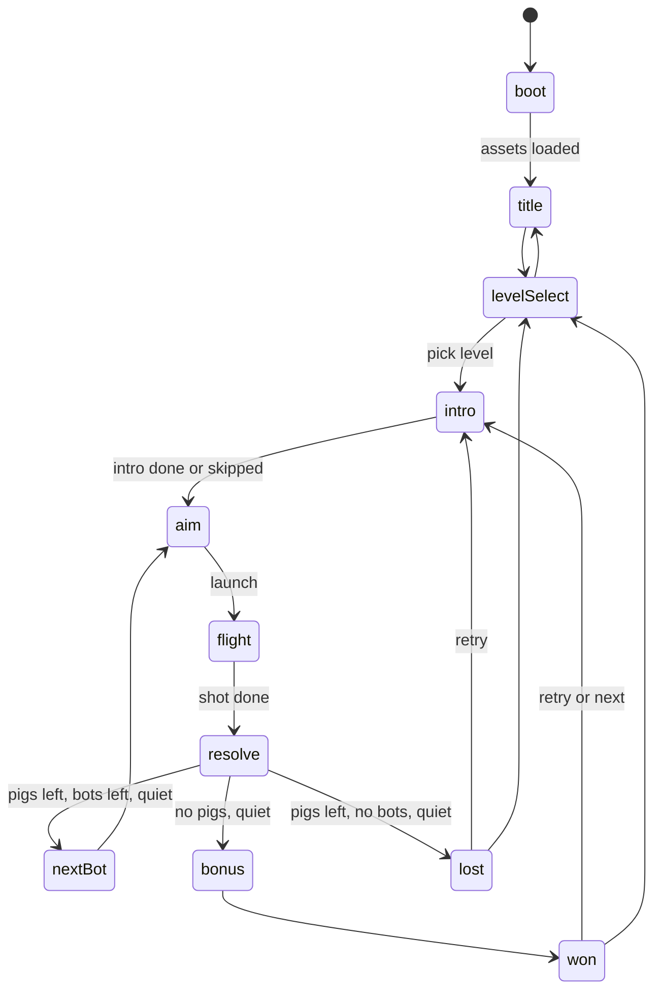

# 06 — Game Flow, Scoring, and UI

Goal: a loop you can replay instantly, clear rules, and a satisfying payoff on every win.

## State machine

`src/game/GameSession.ts` owns a `StateMachine<GameStateId>` (see [01-architecture.md](01-architecture.md#statemachine)).



| State | Enter | Exit condition |
| --- | --- | --- |
| `boot` | Show the loading screen; preload fonts, textures, and audio (except music, which streams) | All loaded |
| `title` | Title screen | Play → `levelSelect` |
| `levelSelect` | Level grid | Pick → load level → `intro` |
| `intro` | Camera intro; first bot in the pouch; show a tutorial tip if this bot kind is new | Intro done (2.2 s) or tap/key |
| `aim` | Sling accepts input; previous trail visible | Launch |
| `flight` | Track the launched bot(s); ability window open | **Shot done**: every bot from this launch is removed, or has moved slower than 0.15 for 0.5 s, or 12 s have passed since launch |
| `resolve` | Keep simulating; score still counts | World quiet for 0.5 s ([02-physics.md](02-physics.md#quiet-detection)), or 10 s in `resolve`. Then decide by pigs and bots left. |
| `nextBot` | Fade out any resting bot (0.3 s, then remove its body); next bot hops to the pouch | Hop done (0.75 s total) |
| `bonus` | Each unused bot, left to right: hop in place, show a "10,000" popup, add 10,000; 0.5 s per bot | Done |
| `won` | Save progress; results panel | Button |
| `lost` | Pig laugh; results panel | Button |

- **Pigs dying during `resolve` count.** A win can happen after a slow collapse. A loss is only decided after quiet.
- **Restart** (HUD button, pause menu, R key) is allowed in `intro`, `aim`, `flight`, `resolve`, `nextBot`, `won`, and `lost`. It reloads the level and goes to `intro` with the **overview skipped** (straight to sling view), matching Angry Birds' instant retry. Target time from tap to aimable: ≤ 400 ms.
- **Pause** is not a state (see [01-architecture.md](01-architecture.md#fixedsteploop)). The pause button and Escape work in every play state. Tab hidden → pause.

## Scoring

```ts
// src/game/Scoring.ts
export const SCORE = { pig: 5000, kingPig: 10000, unusedBot: 10000,
  destroy: { glass: 300, wood: 500, stone: 800, tnt: 500 }, damagePerHp: 10 };
```

| Source | Points | When |
| --- | --- | --- |
| Block damage | `10 × round(hp removed)`, capped at the hp left | Every damaging impact ([02-physics.md](02-physics.md#damage-model)) |
| Block destroyed | By material (table above) | On destroy, not for out-of-bounds |
| Pig destroyed | 5,000 (king 10,000) | On destroy, including out of bounds |
| Unused bot | 10,000 each | `bonus` state, only on a win |

- **Stars:** `stars(score) = count of thresholds ≤ score` using the level's `stars`, but **0 on a loss**. A win always gives at least 1 star, even when the score is below `stars[0]`.
- **Best score and best stars** are saved per level and only go up.
- Score changes emit `score:changed`, which the HUD animates.

## Save data v2

Key: `angrybots-save-v2` in `localStorage`. Every read and write is wrapped in try/catch; on failure use defaults in memory.

```ts
export type SaveV2 = {
  version: 2;
  levels: Record<string, { bestScore: number; stars: 0 | 1 | 2 | 3; cleared: boolean }>;
  settings: { music: number; sfx: number; voice: number;   // 0..1
              aimGuide: 'off' | 'short'; reducedMotion: boolean | null };  // null = follow OS
  tutorialsSeen: Partial<Record<BotKind, true>>;
  lastLevelId: string | null;
};
```

- **Unlocking** is derived, not stored. A level is unlocked if it's the first level of the first chapter, the previous level (by chapter, then `order`) is cleared, or it's the first level of a chapter whose previous chapter's last level is cleared.
- **Migration from v1** (`angrybots-progress-v1`): copy `masterVolume` into `music`, `sfx`, and `voice`; copy `reducedMotion`; drop level progress (every level id changed). Delete the v1 key after a successful migration.
- A corrupt or unknown version → defaults. Never throw.

## UI

DOM overlay above the canvas (not drawn in WebGL). Files are in `src/ui/`.

### Style

- **Font:** "Baloo 2" (SIL Open Font License), from the `@fontsource/baloo-2` package, weights 600 and 800. Fallback `system-ui`.
- **Buttons:** rounded 14 px, fill from `PALETTE.ui.button`, 3 px outline `PALETTE.outline`, a 4 px darker bottom edge for a chunky look. Press: `translateY(3px)` and the bottom edge shrinks to 1 px over 80 ms.
- **Text:** white, with an outline made from 4 text-shadows in `PALETTE.outline`.
- **Minimum touch target:** 48 × 48 CSS px.
- **Colors:** only from `PALETTE.ui` in `src/config/render.ts` (see [07-art-toon.md](07-art-toon.md#palette)).

### HUD

| Position | Element |
| --- | --- |
| Top-left | Pause button, Restart button (48 px each, 8 px gap), with safe-area insets |
| Top-right | Score (32 px, weight 800, counts up toward the true score at 8,000 points/s, minimum 0.3 s per change). "Best: N" below (14 px). |
| Near the loaded bot | Tutorial tip card when this bot kind is new: "Tap while flying to BOOST!" (per kind) plus an animated tap icon. It hides at launch and marks `tutorialsSeen[kind]`. |
| Top-center, transient | Level name for 1.5 s at level start, fading out |

The HUD doesn't show bot pips. The in-world bot queue replaces them ([04-slingshot-and-bots.md](04-slingshot-and-bots.md#bot-queue)).

### Pause menu

Dims the canvas to 55%. Buttons, in order: Resume, Restart, Levels, Settings. Settings is inline in the same panel:

- sliders for Music, Effects, Voices
- a toggle for Aim guide (Off/Short)
- a toggle for Reduced motion
- all changes apply live and save immediately

### Results

- The panel scales in from 0.85 to 1.0 over 0.25 s (ease-out-back). With reduced motion: a 0.15 s fade.
- Title: "Level Cleared!" or "Level Failed".
- Score counts up from 0 over 1.5 s. As it passes each star threshold, that star pops in (scale 0 → 1.2 → 1 over 0.3 s) with the `star_N` sound.
- A "New best!" ribbon when the best score improved.
- Buttons:
  - win: Levels, Retry, **Next** (primary, focused)
  - loss: Levels, **Retry** (primary, focused)
- On the last level of the last chapter, Next shows "More levels coming soon" instead.

### Level select

- One page per chapter with left and right arrows. The chapter name is the header, with total stars earned and possible ("11 / 15 ★").
- A 5-column grid of level buttons. Each shows its number, three small stars (earned ones filled), or a lock icon.
- The current or last-played level pulses gently.

### Title

- "Angry Bots" logo text (Baloo 2 800, 96 px, outlined, a slight 3° tilt), a Play button, and a Settings button.
- Background: the game environment with the waiting-bot idle animation and pigs on a small tower (use First Flight's layout, rendering only, no physics).

### Loading

- Before `title`: a progress bar driven by the asset loader.
- Target: first playable in ≤ 5 s on 10 Mbps with an empty cache ([09-performance.md](09-performance.md)).

### Rotate prompt

A full-screen overlay with a phone icon rotating 90°, reading "Turn your device sideways". Shown when `(pointer: coarse)` and `innerHeight > innerWidth`. The game loop pauses while it's shown and resumes automatically after rotation (it doesn't open the pause menu).

### Keyboard and accessibility

| Key | Action |
| --- | --- |
| Escape | Pause / resume |
| R | Restart |
| Enter | Primary button on the current panel |
| Space | Ability during flight; launch when using keyboard aim |
| Arrows | Keyboard aim ([04-slingshot-and-bots.md](04-slingshot-and-bots.md#sling-model-and-input)) |

- Every control is a real `<button>` or `<input>` with an `aria-label`.
- Focus is visible (3 px outline in `PALETTE.ui.focus`).
- Text contrast is ≥ 4.5:1.
- Panels trap focus and return it on close.
- `aria-live="polite"` announces "Level cleared, 3 stars, score 31,350" and "Level failed".

## Tasks

### GAME-01 — GameSession rules (M)

- **Depends on:** PHY-08, SLG-01
- **Do:** implement the state table, shot-done, resolve, and bonus logic headless. The render and input layers only call `session.launch()`, `session.activateAbility()`, `session.restart()`, `session.update(dt)`.
- **Tests:** `tests/physics/session.test.ts` with fixture launches:
  - First Flight solution → states pass through `flight`, `resolve`, `bonus`, `won`; final score = 31,350 ± 0.5% (the solver score in [03-levels.md](03-levels.md#slice-levels-verified), which already includes 20,000 for 2 unused bots)
  - three misses (launch 80°, 10 m/s, which lands behind the sling) → `lost` after the third resolve
  - a pig killed by a collapse after the bot has stopped → still a win
  - restart during `flight` → a fresh level, the same bot queue, score 0

### GAME-02 — State machine wiring (S)

- **Depends on:** GAME-01, APP-02
- **Tests:** transitions not in the table throw; pausing in `flight` for 5 s and resuming → the bot's position is unchanged across the pause and its velocity continues (the old R02 regression).

### GAME-03 — Scoring and stars (S)

- **Depends on:** GAME-01
- **Tests:** unit: damage points are capped at hp; out-of-bounds blocks give no destroy points; a win below `stars[0]` gives 1 star; a loss gives 0 stars.

### GAME-04 — Save v2 and migration (S)

- **Depends on:** GAME-03
- **Do:** delete `game/ProgressStore.ts`.
- **Tests:**
  - v1 → v2 migration maps volumes
  - corrupt JSON → defaults
  - `localStorage` throwing → still playable, with defaults in memory
  - unlock rules across chapters
  - best-only updates

### UI-01 — HUD (S)

- **Depends on:** GAME-02
- **Tests:** e2e: score counts up after a destroy; the restart button reloads (a snapshot shows `botsLeft` = full); `tutorialsSeen` persists across reload.

### UI-02 — Pause and settings (S)

- **Depends on:** UI-01, GAME-04
- **Tests:** e2e: Escape toggles; sliders save to `localStorage` (audio wiring comes in AUD-02); the Restart button works from pause; tab hidden pauses.

### UI-03 — Results (S)

- **Depends on:** UI-01, GAME-03
- **Tests:** e2e: after a win, the stars shown equal `snapshot().stars` and focus is on Next; after a loss there's no Next. Visual snapshot of both panels.

### UI-04 — Title, level select, loading (M)

- **Depends on:** UI-03, GAME-04
- **Tests:** e2e: locked levels are disabled; clearing level 1 unlocks level 2; the chapter star total is right. Visual snapshots.

### UI-05 — Rotate prompt, keyboard, accessibility (S)

- **Depends on:** UI-04
- **Tests:** e2e: at 390×844 on a coarse pointer, the prompt is visible and the loop is paused; at 844×390 it's hidden. Keyboard-only play: Enter to start, pick a level, arrow aim, Space launch, R restart. `@axe-core/playwright` finds no serious or critical issues on title, pause, and results.

### UI-06 — Remove the old overlay (S)

- **Depends on:** UI-05
- **Do:** delete `ui/FlowOverlay.ts`, `style.css`, and the old HUD code in `Game.ts` (if any remains).
