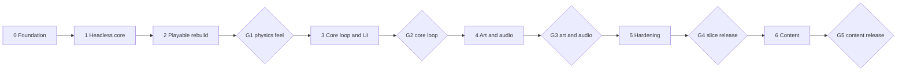

# Plan — AngryBots v2

71 tasks in 7 phases, each ending in a gate. Tasks are written to be done one at a time by an implementing model, with a human reviewing each PR and running the human gates. Read [README.md](README.md) first; its rules apply to every task.

## Phases



A gate that fails sends work back: file issues against the tasks involved, fix them, and rerun the gate. Don't start the next phase with an open gate, except that audio tasks AUD-01..03 may start in Phase 3 as listed.

| Phase | Name | Tasks | Effort (model days) | Human tasks | Exit criteria | Gate |
| --- | --- | --- | --- | --- | --- | --- |
| 0 | Foundation | 7 | 3.5 | — | `npm run verify` green on the cleaned tree; the game still runs as before. | — |
| 1 | Headless core | 14 | 13 | — | All calibration rows C1–C13 pass; all 5 slice levels pass S1–S7 and P1–P5; determinism test passes. | — |
| 2 | Playable rebuild | 8 | 10.5 | — | Every slice level can be won with real input; no forbidden patterns; `Game.ts` deleted. | G1 — Physics feel |
| 3 | Core loop and UI | 15 | 10.5 | — | The e2e suite passes 3 times in a row; restart ≤ 400 ms. | G2 — Core loop |
| 4 | Art and audio | 14 | 14 | AUD-07, AUD-06, AUD-08 | All visual baselines approved; every non-HUMAN sound id has files. | G3 — Art and audio |
| 5 | Hardening | 4 | 2.5 | PERF-04 | All budgets in 09-performance.md met on reference devices. | G4 — Slice release |
| 6 | Content | 9 | 17 | — | 30 levels pass `level:check` with committed solutions; difficulty curve documented. | G5 — Content release |

**Total: about 71 model-days** (S = 0.5, M = 1.5, L = 4, including review and fixes), plus the human tasks and gates. With one reviewer that's roughly 16–20 calendar weeks. Phases 4 and 6 are the largest; within them, tasks without a dependency between them can run in parallel sessions.

## How to run a task

Give the implementing model this prompt, with the task id filled in. One task per session.

```text
You are implementing task <ID> of the AngryBots v2 specs.
1. Read docs/specs/README.md (rules), docs/specs/PLAN.md (this task's row), and the spec file that defines <ID>.
2. Check that every task in "Depends on" is marked done in public/progress.json. If not, stop and report.
3. Write the task's tests first and run them; they should fail.
4. Implement until they pass. Follow the spec exactly. Don't change tuning, tests, or other tasks' files unless the task says so.
5. Run `npm run verify`. Fix failures you caused.
6. Do the task's "Do" deletions and doc updates.
7. Mark the task done: node scripts/update-progress.mjs task <ID> done
8. Commit as "<ID>: <task title>" and summarize: what changed, test results, anything added to docs/specs/ISSUES.md.
If a README rule 7 stop condition happens, stop and report instead of improvising.
```

**Review checklist** (for the human on each PR):

- The tests in the task are present and would fail without the change.
- No test, threshold, or tuning value changed that the task didn't name.
- `npm run verify` is green in CI.
- Deletions named in the task happened.
- The diff stays inside the files the task names, plus tests and docs.

## Task list

Sizes: **S** ≈ half a day, **M** ≈ 1–2 days, **L** ≈ 3–5 days for the model including fixes. **HUMAN** tasks need a person.

### Phase 0 — Foundation

Clean branch, core utilities, pure-math modules, the guard rails (forbidden-pattern check, gate templates).

| # | Task | Spec | Depends on | Size |
| --- | --- | --- | --- | --- |
| APP-01 | Branch, cleanup, tooling | [01-architecture.md](01-architecture.md#app-01--branch-cleanup-tooling-s) | — | S |
| APP-02 | Core: EventBus, FixedStepLoop, StateMachine, rng | [01-architecture.md](01-architecture.md#app-02--core-eventbus-fixedsteploop-statemachine-rng-s) | APP-01 | S |
| QA-01 | Forbidden-pattern check | [10-qa.md](10-qa.md#qa-01--forbidden-pattern-check-s) | APP-01 | S |
| QA-05 | Human gate kit | [10-qa.md](10-qa.md#qa-05--human-gate-kit-s) | — | S |
| LVL-01 | Schema, kit, loader | [03-levels.md](03-levels.md#lvl-01--schema-kit-loader-s) | APP-01 | S |
| SLG-01 | Launch math | [04-slingshot-and-bots.md](04-slingshot-and-bots.md#slg-01--launch-math-s) | APP-01 | S |
| CAM-01 | fitRect and clampView | [05-camera.md](05-camera.md#cam-01--fitrect-and-clampview-s) | APP-01 | S |

**Exit:** `npm run verify` green on the cleaned tree; the game still runs as before.

### Phase 1 — Headless core

The new physics, damage, levels, and rules, all tested in Node with no rendering.

| # | Task | Spec | Depends on | Size |
| --- | --- | --- | --- | --- |
| PHY-01 | Planck world and categories | [02-physics.md](02-physics.md#phy-01--planck-world-and-categories-s) | APP-01 | S |
| LVL-02 | Static validator | [03-levels.md](03-levels.md#lvl-02--static-validator-m) | LVL-01 | M |
| PHY-02 | Entities and bodies | [02-physics.md](02-physics.md#phy-02--entities-and-bodies-m) | PHY-01, LVL-01 | M |
| PHY-03 | Contact pipeline and damage | [02-physics.md](02-physics.md#phy-03--contact-pipeline-and-damage-m) | PHY-02 | M |
| PHY-05 | Support collapse | [02-physics.md](02-physics.md#phy-05--support-collapse-s) | PHY-03 | S |
| PHY-06 | Fragments | [02-physics.md](02-physics.md#phy-06--fragments-m) | PHY-03 | M |
| PHY-07 | Explosions and TNT chains | [02-physics.md](02-physics.md#phy-07--explosions-and-tnt-chains-s) | PHY-03 | S |
| PHY-08 | Out of bounds and quiet detection | [02-physics.md](02-physics.md#phy-08--out-of-bounds-and-quiet-detection-s) | PHY-02 | S |
| PHY-09 | Determinism | [02-physics.md](02-physics.md#phy-09--determinism-s) | PHY-07 | S |
| LVL-03 | Physics validator, tools, solutions | [03-levels.md](03-levels.md#lvl-03--physics-validator-tools-solutions-m) | LVL-02, PHY-07 | M |
| LVL-04 | Level registry and chapters | [03-levels.md](03-levels.md#lvl-04--level-registry-and-chapters-s) | LVL-03 | S |
| GAME-01 | GameSession rules | [06-game-flow-ui.md](06-game-flow-ui.md#game-01--gamesession-rules-m) | PHY-08, SLG-01 | M |
| GAME-03 | Scoring and stars | [06-game-flow-ui.md](06-game-flow-ui.md#game-03--scoring-and-stars-s) | GAME-01 | S |
| QA-04 | CI pipeline | [10-qa.md](10-qa.md#qa-04--ci-pipeline-s) | QA-01, LVL-03 | S |

**Exit:** All calibration rows C1–C13 pass; all 5 slice levels pass S1–S7 and P1–P5; determinism test passes.

### Phase 2 — Playable rebuild

Wire the new core into the browser with placeholder toon visuals: aim, launch, abilities, camera. Retire `Game.ts` and anchoring.

| # | Task | Spec | Depends on | Size |
| --- | --- | --- | --- | --- |
| REN-01 | Renderer, toon material, outlines | [07-art-toon.md](07-art-toon.md#ren-01--renderer-toon-material-outlines-s) | APP-02 | S |
| SLG-02 | SlingModel and SlingInput | [04-slingshot-and-bots.md](04-slingshot-and-bots.md#slg-02--slingmodel-and-slinginput-m) | SLG-01, APP-02 | M |
| GAME-02 | State machine wiring | [06-game-flow-ui.md](06-game-flow-ui.md#game-02--state-machine-wiring-s) | GAME-01, APP-02 | S |
| CAM-02 | CameraDirector modes | [05-camera.md](05-camera.md#cam-02--cameradirector-modes-m) | CAM-01, GAME-02 | M |
| SLG-04 | Bot profiles and abilities | [04-slingshot-and-bots.md](04-slingshot-and-bots.md#slg-04--bot-profiles-and-abilities-m) | PHY-03, SLG-02 | M |
| APP-03 | App wiring; retire Game.ts | [01-architecture.md](01-architecture.md#app-03--app-wiring-retire-gamets-l) | APP-02, PHY-02, LVL-03, SLG-02, GAME-02, CAM-02, REN-01 | L |
| PHY-04 | Remove anchoring and scripted collisions | [02-physics.md](02-physics.md#phy-04--remove-anchoring-and-scripted-collisions-s) | PHY-03, APP-03 | S |
| PERF-01 | Bench and counters | [09-performance.md](09-performance.md#perf-01--bench-and-counters-s) | PHY-02, REN-01 | S |

**Exit:** Every slice level can be won with real input; no forbidden patterns; `Game.ts` deleted. Then run gate **G1 — Physics feel** ([10-qa.md](10-qa.md#human-gates)).

### Phase 3 — Core loop and UI

Everything around the shot: trail, bot queue, manual camera, HUD, restart, pause, results, level select, save, audio plumbing, the new e2e suite.

| # | Task | Spec | Depends on | Size |
| --- | --- | --- | --- | --- |
| SLG-03 | Shot trail and aim guide | [04-slingshot-and-bots.md](04-slingshot-and-bots.md#slg-03--shot-trail-and-aim-guide-s) | SLG-02, REN-01 | S |
| SLG-05 | Bot queue and hop | [04-slingshot-and-bots.md](04-slingshot-and-bots.md#slg-05--bot-queue-and-hop-s) | SLG-04, APP-03 | S |
| CAM-03 | Manual look | [05-camera.md](05-camera.md#cam-03--manual-look-s) | CAM-02, SLG-02 | S |
| CAM-04 | Shake, slow motion, reduced motion | [05-camera.md](05-camera.md#cam-04--shake-slow-motion-reduced-motion-s) | CAM-02 | S |
| GAME-04 | Save v2 and migration | [06-game-flow-ui.md](06-game-flow-ui.md#game-04--save-v2-and-migration-s) | GAME-03 | S |
| UI-01 | HUD | [06-game-flow-ui.md](06-game-flow-ui.md#ui-01--hud-s) | GAME-02 | S |
| UI-02 | Pause and settings | [06-game-flow-ui.md](06-game-flow-ui.md#ui-02--pause-and-settings-s) | UI-01, GAME-04 | S |
| UI-03 | Results | [06-game-flow-ui.md](06-game-flow-ui.md#ui-03--results-s) | UI-01, GAME-03 | S |
| UI-04 | Title, level select, loading | [06-game-flow-ui.md](06-game-flow-ui.md#ui-04--title-level-select-loading-m) | UI-03, GAME-04 | M |
| UI-05 | Rotate prompt, keyboard, accessibility | [06-game-flow-ui.md](06-game-flow-ui.md#ui-05--rotate-prompt-keyboard-accessibility-s) | UI-04 | S |
| UI-06 | Remove the old overlay | [06-game-flow-ui.md](06-game-flow-ui.md#ui-06--remove-the-old-overlay-s) | UI-05 | S |
| AUD-01 | SoundBank and buses | [08-audio.md](08-audio.md#aud-01--soundbank-and-buses-m) | APP-02 | M |
| AUD-02 | Settings and lifecycle | [08-audio.md](08-audio.md#aud-02--settings-and-lifecycle-s) | AUD-01, UI-02 | S |
| AUD-03 | Event mapping | [08-audio.md](08-audio.md#aud-03--event-mapping-s) | AUD-01, GAME-02 | S |
| QA-02 | Rewrite the e2e suite | [10-qa.md](10-qa.md#qa-02--rewrite-the-e2e-suite-m) | SLG-02, GAME-02, UI-03 | M |

**Exit:** The e2e suite passes 3 times in a row; restart ≤ 400 ms. Then run gate **G2 — Core loop** ([10-qa.md](10-qa.md#human-gates)).

### Phase 4 — Art and audio

Toon characters, blocks with damage stages, environment, effects, popups; generated sound effects and voices; visual baselines.

| # | Task | Spec | Depends on | Size |
| --- | --- | --- | --- | --- |
| REN-02 | Blocks and damage stages | [07-art-toon.md](07-art-toon.md#ren-02--blocks-and-damage-stages-m) | REN-01, PHY-03 | M |
| REN-03 | Characters | [07-art-toon.md](07-art-toon.md#ren-03--characters-l) | REN-01 | L |
| REN-04 | Slingshot view | [07-art-toon.md](07-art-toon.md#ren-04--slingshot-view-s) | REN-01, SLG-02 | S |
| REN-05 | Environment and blob shadows | [07-art-toon.md](07-art-toon.md#ren-05--environment-and-blob-shadows-m) | REN-01 | M |
| REN-06 | Particles and effects | [07-art-toon.md](07-art-toon.md#ren-06--particles-and-effects-m) | REN-01, PHY-06, PHY-07 | M |
| REN-07 | Fragments view | [07-art-toon.md](07-art-toon.md#ren-07--fragments-view-s) | REN-02, PHY-06 | S |
| REN-08 | Score popups and trail view | [07-art-toon.md](07-art-toon.md#ren-08--score-popups-and-trail-view-s) | REN-06, SLG-03, GAME-03 | S |
| REN-09 | Remove old visuals | [07-art-toon.md](07-art-toon.md#ren-09--remove-old-visuals-s) | REN-08 | S |
| QA-03 | Deterministic mode and visual baselines | [10-qa.md](10-qa.md#qa-03--deterministic-mode-and-visual-baselines-m) | REN-05, CAM-02 | M |
| AUD-04 | Generated SFX pipeline | [08-audio.md](08-audio.md#aud-04--generated-sfx-pipeline-m) | AUD-03 | M |
| AUD-07 | Voices | [08-audio.md](08-audio.md#aud-07--voices-model-placeholder-human-upgrade) | — | HUMAN |
| AUD-05 | Remove the synth fallback | [08-audio.md](08-audio.md#aud-05--remove-the-synth-fallback-s) | AUD-04, AUD-07 | S |
| AUD-06 | Music | [08-audio.md](08-audio.md#aud-06--music-human-s-for-the-integration-part) | — | HUMAN |
| AUD-08 | Listening gate | [08-audio.md](08-audio.md#aud-08--listening-gate-human) | — | HUMAN |

**Exit:** All visual baselines approved; every non-HUMAN sound id has files. Then run gate **G3 — Art and audio** ([10-qa.md](10-qa.md#human-gates)).

### Phase 5 — Hardening

Performance pools, disposal soak, load budget, device session.

| # | Task | Spec | Depends on | Size |
| --- | --- | --- | --- | --- |
| PERF-02 | Pools and allocation audit | [09-performance.md](09-performance.md#perf-02--pools-and-allocation-audit-m) | REN-06, REN-08 | M |
| PERF-03 | Disposal and restart soak | [09-performance.md](09-performance.md#perf-03--disposal-and-restart-soak-s) | PERF-02, GAME-01 | S |
| PERF-05 | Load budget | [09-performance.md](09-performance.md#perf-05--load-budget-s) | AUD-04, UI-04 | S |
| PERF-04 | Device session | [09-performance.md](09-performance.md#perf-04--device-session-human) | — | HUMAN |

**Exit:** All budgets in 09-performance.md met on reference devices. Then run gate **G4 — Slice release** ([10-qa.md](10-qa.md#human-gates)).

### Phase 6 — Content

New pieces, pig types, Blast bot, terrain, chapters 1–3 (30 levels), balance.

| # | Task | Spec | Depends on | Size |
| --- | --- | --- | --- | --- |
| CNT-04 | Ramp and ledge terrain | [11-content.md](11-content.md#cnt-04--ramp-and-ledge-terrain-s) | Gate G4 | S |
| CNT-01 | Wheel and triangle kit | [11-content.md](11-content.md#cnt-01--wheel-and-triangle-kit-m) | CNT-04 | M |
| CNT-02 | Hat and king pigs | [11-content.md](11-content.md#cnt-02--hat-and-king-pigs-s) | Gate G4 | S |
| CNT-03 | Blast bot | [11-content.md](11-content.md#cnt-03--blast-bot-s) | Gate G4 | S |
| CNT-05 | Chapter theming | [11-content.md](11-content.md#cnt-05--chapter-theming-s) | CNT-04 | S |
| CNT-06 | Chapter 1 levels 6–10 | [11-content.md](11-content.md#cnt-06--chapter-1-levels-610-l) | CNT-01, CNT-02 | L |
| CNT-07 | Chapter 2 | [11-content.md](11-content.md#cnt-07--chapter-2-l) | CNT-06, CNT-04, CNT-05 | L |
| CNT-08 | Chapter 3 | [11-content.md](11-content.md#cnt-08--chapter-3-l) | CNT-07, CNT-03 | L |
| CNT-09 | Balance pass | [11-content.md](11-content.md#cnt-09--balance-pass-m) | CNT-08 | M |

**Exit:** 30 levels pass `level:check` with committed solutions; difficulty curve documented. Then run gate **G5 — Content release** ([10-qa.md](10-qa.md#human-gates)).

## Critical path

APP-01 → APP-02 → LVL-01 → PHY-01 → LVL-02 → PHY-02 → PHY-03 → PHY-07 → LVL-03 → GAME-01 → GAME-02 → CAM-02 → APP-03 → **G1** → UI-01 → UI-03 → QA-02 → **G2** → REN-03 / REN-06 → REN-08 → **G3** → PERF-02 → PERF-03 → **G4** → CNT-04 → CNT-01 → CNT-06 → CNT-07 → CNT-08 → CNT-09 → **G5**

Start the HUMAN music task (AUD-06) as early as Phase 2. Commissioning music is the longest lead-time item, and nothing else waits on it until G3.

## Risks

| Risk | Where it shows | Mitigation |
| --- | --- | --- |
| Planck stacks jitter in taller levels | P1 settle fails on new content | Raise `posIters` to 10 before touching level geometry; keep stacks ≤ 8 pieces tall |
| Player launch differs from the solver's anchor launch | `win.spec.ts` flakes | The test tries 4 neighbors (±2°, ±1 m/s); solutions are replayed headless in CI regardless |
| Toon look reads as "programmer art" | G3 fails | The gate is early enough to rework palette, outlines, and characters before content; REN-03 is sized L for this |
| Generated sounds feel cheap | G3 listening | Pig voices and jingles are marked for a human upgrade; the manifest keeps ids stable so replacing files needs no code |
| Implementing model drifts from spec | Review | The forbidden-pattern CI, tests-first rule, and stop conditions; reject PRs that touch unlisted files |
| Tuning changes break level balance | P4/P5 and rate numbers | Only tuning tasks may change `tuning.ts`; `level:rate` runs in CI and posts deltas |

## Progress tracking

APP-01 extends `scripts/update-progress.mjs` with `task <ID> <todo|doing|done|blocked> [note]`. It writes `public/progress.json` under `tasks`, and `public/progress.html` shows the phase tables with status colors. The old `pieces` and gauntlet fields are removed.
